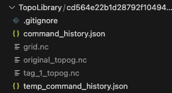
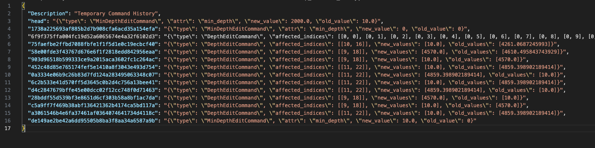
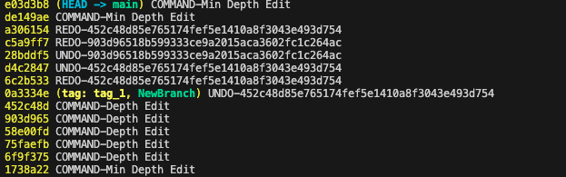

Topo & The Widgets!
===================

This document explains the widget modules in ``mom6_bathy``.

``mom6_bathy`` comes with three UI modules/classes that wrap the three main
classes—``VGrid``, ``Grid``, and ``Topo``—to help with creating vertical grids
(``VGridCreator``), horizontal grids (``GridCreator``), and editing topography
(``TopoEditor``).

Creators
---------------------------

The creators act as visual wrappers around the constructors of their respective
classes, providing sliders and visualizations. They automatically generate
folders called ``VgridLibrary`` and ``GridLibrary`` to store created grids.
The currently selected grid is directly accessible as an object inside each
creator.

GridCreator
^^^^^^^^^^^

``GridCreator`` is a split-panel widget: a control panel on the left and an
interactive cartopy map on the right.  It supports three creation modes,
selected via radio buttons before any grid is defined.

**Lat/Lon Corners**

Click two diagonal corners on the map.  A uniform-degree ``Grid`` is created
from the bounding box.  After creation, five degree sliders appear
(``xstart``, ``ystart``, ``lenx``, ``leny``, ``resolution``) for live
adjustment.

**From Center**

Set the domain width (km), height (km), resolution (km), and a clockwise
rotation angle (degrees from north) in the input fields, then click the
domain centre on the map.  This calls ``Grid.from_center()``, which builds a
rotated rectangular grid using an azimuthal equidistant projection centred at
the clicked point.  This mode is particularly useful for aligning a domain
with a coastline or estuary.

**From Projection**

Set a CRS (chosen from a preset dropdown or typed as any EPSG string) and
resolution (km), then click two corners on the map.  This calls
``Grid.from_projection()``.

When a preset CRS is selected the map axes switches to the matching native
cartopy projection so that clicks deliver coordinates in that projection's
metres directly — no additional transformation is needed, and domains near or
over the poles work correctly.  Supported presets:

.. list-table::
   :header-rows: 1
   :widths: 30 40 30

   * - Preset
     - Cartopy projection
     - Default view
   * - EPSG:4326 (Plate Carrée)
     - PlateCarree (no switch)
     - Global
   * - EPSG:3995 (Arctic Polar Stereographic)
     - NorthPolarStereo
     - 45–90°N
   * - EPSG:3031 (Antarctic Polar Stereographic)
     - SouthPolarStereo
     - 90–45°S
   * - EPSG:5070 (CONUS Albers Equal Area)
     - AlbersEqualArea
     - CONUS
   * - Any other EPSG string
     - PlateCarree (fallback)
     - CRS area-of-use (via pyproj)

**Editing projected grids**

After a projected grid (From Center or From Projection) is created or loaded,
the control panel shows the same parameter inputs pre-filled with the current
values alongside a **Recreate Grid** button.  Adjust the inputs and click
Recreate to rebuild the grid without needing to re-click the map.

**GridLibrary**

Grids are saved as MOM6 supergrid NetCDF files under ``<repo_root>/GridLibrary/``
(naming convention: ``grid_<name>.nc``).  The directory is created automatically
and a blanket ``.gitignore`` is written into it so saved grids are not
accidentally committed.

On **Load**, all creation parameters are restored from the file's metadata, so
the **Recreate** button works immediately after loading a projected grid without
any additional clicks.

Topo & TopoEditor Edits
---------------------------

The ``Topo`` & ``TopoEditor`` workflow is a bit more nuanced.

Grids are simple: they are created once and rarely modified. ``Topo`` objects,
however, are built on top of the horizontal grid and are heavily edited during
the development cycle (filling bays, deepening ridges, etc.).

Because of this, ``Topo`` has many editing functions. ``TopoEditor`` provides a
visual, point-and-click interface on top of these functions.

Current editing functions (``*`` = available in ``TopoEditor``):

1. ``*`` Edit depth at a specific point
2. ``*`` Edit the minimum depth
3. ``*`` Erase a basin at a selected point
4. ``*`` Erase every basin except the one containing the selected point
5. Generate and apply an ocean mask from a land-fraction dataset
6. Apply a ridge to the bathymetry

You can also reapply an initializer (none supported in the TopoEditor):

1. Set flat bathy
2. Set spoon bathy
3. Set bowl bathy
4. Set from dataset
5. Set from previous topo object

Undo & Redo
------------

To support the iterative editing process, we provide **undo and redo**
functionality across sessions. This requires maintaining a structured history,
stored inside a directory associated with your ``Topo`` object.

This folder contains:

1. The grid underlying the topo
2. The original blank topo
3. A permanent command history

   Layout of a ``Topo`` folder.

   Structure of the command history JSON file.

How It Works
------------

1. You create your ``Topo`` object, which initializes the four files above.
2. You make changes using ``Topo`` or ``TopoEditor``.
3. Each change is added to history.
4. Each change is then **committed via Git**—this powers undo/redo.

Topo Git Functionality and How to Use It
---------------------

We use Git to implement undo/redo functionality inside the topo directory.

You can view the history with:

``git log``

The command history is a JSON file mapping commit SHAs to change
metadata. You can cross-reference the Git log with this JSON file to inspect
details of each edit.

We also support simple version-control actions:

- ``topo.tcm.create_branch("branchname")`` — create a branch  
- ``topo.tcm.checkout("branchname")`` — switch branches  
- ``topo.tcm.tag("tagname")`` — create a tag and save a ``tagname_topog.nc`` file  

Tags cannot be checked out (this can cause unexpected states).

Undo and redo:

- ``topo.tcm.undo()``
- ``topo.tcm.redo()``

These appear in the Git log as:

- ``UNDO-<sha>``
- ``REDO-<sha>``

Be careful not to undo your initial set-function!

.. warning::

   Do **not** run Git commands inside this folder except for harmless commands like ``git log``.
   We manage the folder internally. External Git commands (like ``git checkout``)
   may break state management.

   Example ``git log`` for a topo editing session.

Nuances (Initialization, Naming, etc.)
--------------------------------------

Folders are named after the hash of the grid's ``tlon`` variable.  
This means that **any topo using the same grid** will share the same folder.

You can initialize ``Topo`` in three ways:

1. ``Topo()`` — creates an empty topo with the provided minimum depth
2. ``Topo.from_version_control(path)`` — loads a folder, applies saved history, and returns the reconstructed topo
3. ``Topo.from_topo_file(file)`` — loads a topo file and applies it on top of any existing changes in the folder

All of the git versioning (undo, redo, reset, checkout, tag, create branch) is handled by the TopoCommandManager, which can be accessed as the class variable "tcm". The code for this manager resides in the command_manager class. 
We would use straight git functions, but the topo file itself is handled independently of the commits. (In the future, expect this to use icechunk)

See also the demonstration notebook:

`6_demo_editors.ipynb <https://github.com/NCAR/mom6_bathy/blob/master/notebooks/6_demo_editors.ipynb>`_

